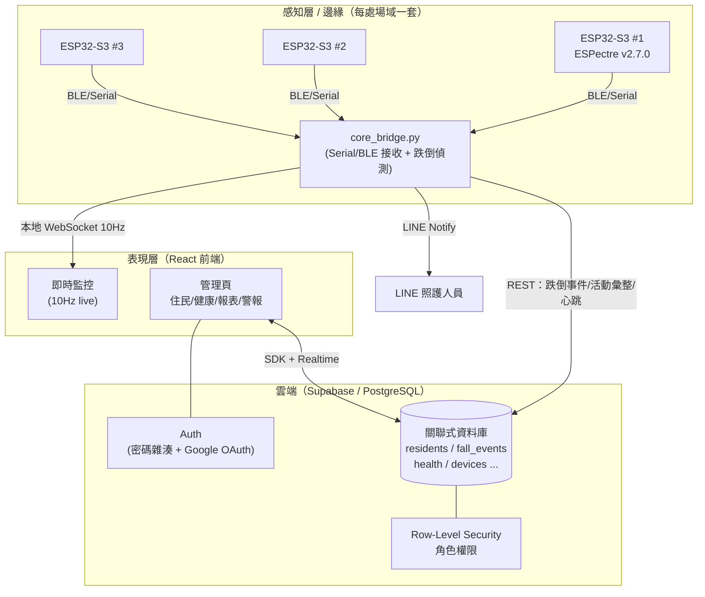
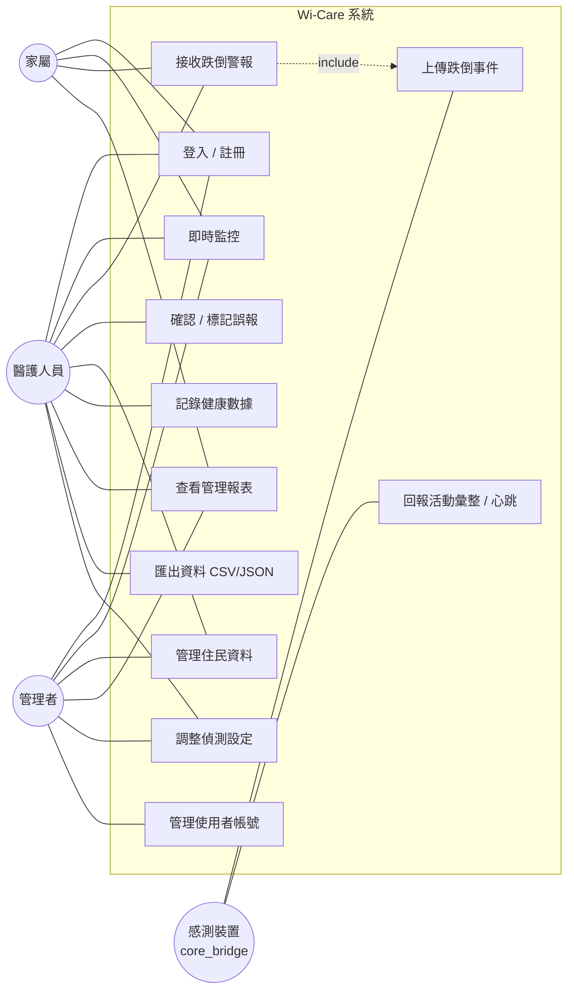
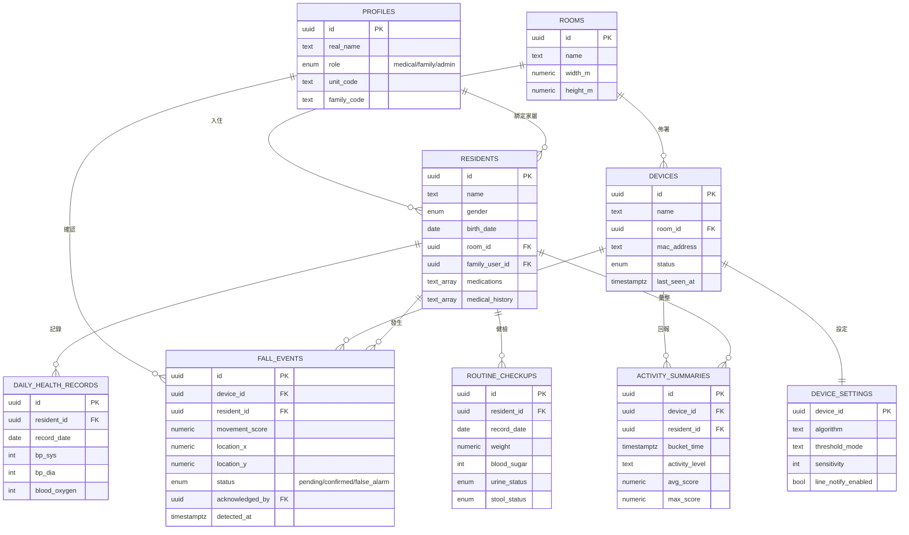
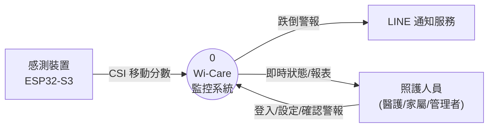
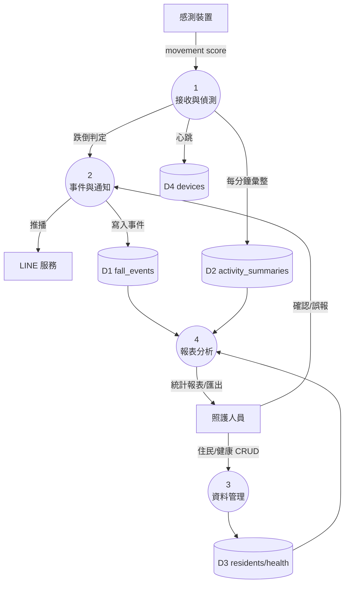
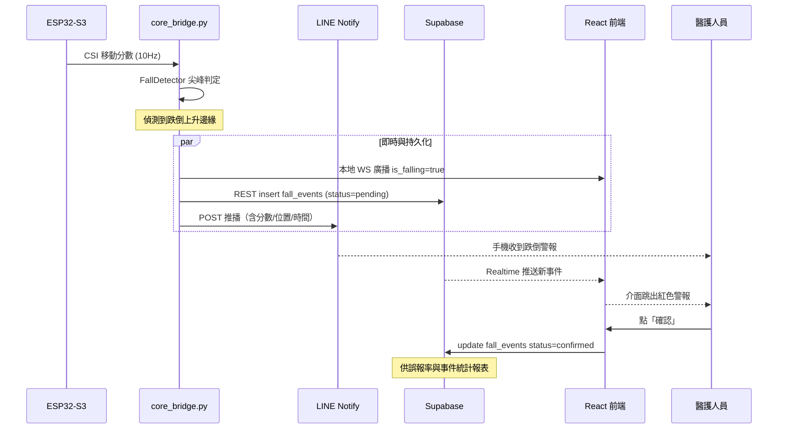

# Wi-Care 系統分析與設計（SA/SD）

> 本文件為論文附錄，涵蓋使用案例、實體關聯模型、資料流程圖、循序圖與系統架構。
> 所有圖以 [Mermaid](https://mermaid.js.org/) 撰寫，可於 GitHub / VS Code 直接渲染。

---

## 1. 系統架構圖（邊緣 + 雲端 Hybrid）

**設計理念**：高頻即時訊號（10Hz movement score）走**本地 WebSocket**確保零延遲；
具管理意義的事件（跌倒、每分鐘活動彙整、裝置心跳）與所有業務資料走**雲端關聯式資料庫**，
支援多裝置、多使用者、跨地點存取。

---

## 2. 使用案例圖（Use Case Diagram）

### 使用案例說明（節錄）

| 編號 | 名稱 | 主要參與者 | 前置條件 | 主要流程 |
|------|------|-----------|---------|---------|
| UC2 | 即時監控 | 醫護/家屬/管理者 | 已登入、裝置在線 | 開啟監控頁 → 訂閱本地 WS → 顯示 10Hz 移動分數、活動狀態、定位 |
| UC3 | 接收跌倒警報 | 醫護/家屬 | 已登入 | 系統偵測跌倒 → 寫入 `fall_events` → 前端即時跳出警報 + LINE 推播 |
| UC4 | 確認/誤報 | 醫護 | 有 pending 警報 | 點「確認」或「誤報」→ 更新事件 status → 供誤報率統計 |
| UC7 | 查看管理報表 | 醫護/家屬/管理者 | 已登入 | 選住民/期間 → 查詢彙整檢視表 → 顯示跌倒統計、活動趨勢、在線率 |
| UC11 | 上傳跌倒事件 | 感測裝置 | 後端持有 service key | 跌倒上升邊緣 → REST insert `fall_events` |

---

## 3. 實體關聯模型（ER Diagram）

> 對應實作：[`supabase/migrations/0001_initial_schema.sql`](../supabase/migrations/0001_initial_schema.sql)

---

## 4. 資料流程圖（DFD）

### 4.1 Context Diagram（第 0 層）

### 4.2 Level-1 DFD

---

## 5. 循序圖：跌倒偵測 → 警報 → 確認

---

## 6. 權限控管（RLS）對照

| 角色 | residents | fall_events / health | 報表 | 使用者管理 | 偵測設定 |
|------|-----------|----------------------|------|-----------|---------|
| admin | 全部 R/W | 全部 R/W | ✅ | ✅ | ✅ |
| medical | 全部 R/W | 全部 R/W | ✅ | ❌ | ✅ |
| family | 僅綁定住民 R | 僅綁定住民 R | 僅綁定住民 | ❌ | ❌ |

> 實作於 migration 的 RLS policy 與 `public.current_role()` 函式。

---

*最後更新：2026 年 6 月*
